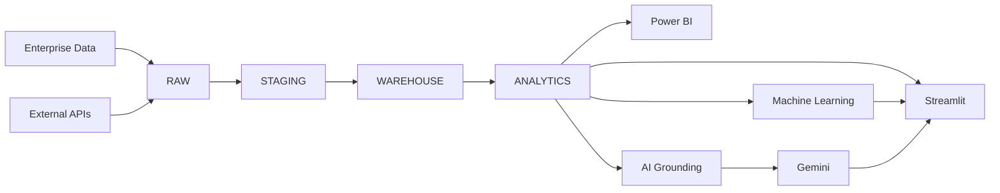

<div align="center">

# Nexus360

### Enterprise Intelligence & Decision Automation Platform

**From raw enterprise data to governed analytics, machine learning, grounded AI and executive decision intelligence.**

<br>


<br>

**Data Engineering · Analytics Engineering · Machine Learning · Generative AI · Business Intelligence · Decision Automation**

</div>

---

## Overview

**Nexus360** is an end-to-end **Enterprise Intelligence & Decision Automation Platform** designed to transform fragmented enterprise and external data into governed analytics, predictive intelligence and grounded AI-assisted business decisions.

The platform integrates:

- PostgreSQL data engineering
- Dimensional data warehousing
- Advanced SQL analytics
- Machine learning
- Grounded generative AI
- Streamlit applications
- Power BI Desktop
- External intelligence APIs
- Incremental pipelines
- Automated testing
- Cloud PostgreSQL deployment

Nexus360 is designed as an integrated intelligence architecture rather than an isolated dashboard or machine-learning project.

```text
Enterprise Data + External Intelligence
                  |
                  v
             RAW LAYER
                  |
                  v
           STAGING LAYER
                  |
                  v
          WAREHOUSE LAYER
                  |
                  v
          ANALYTICS LAYER
             /         \
            /           \
           v             v
     ML / AI         Business BI
        |             /       \
        v            v         v
   AI Copilot   Streamlit   Power BI
        \            |         /
         \           |        /
          +----------+-------+
                     |
                     v
             Business Decisions
```

---

# Platform Capabilities

<table>
<tr>
<td width="50%" valign="top">

### Enterprise Data Platform

Layered PostgreSQL architecture covering:

- RAW ingestion
- STAGING transformations
- Analytical warehouse
- Business semantic views
- Incremental processing

</td>
<td width="50%" valign="top">

### Decision Intelligence

Business-ready analytics covering:

- Revenue intelligence
- Customer 360
- Cloud FinOps
- Subscription health
- Market intelligence
- Risk analytics

</td>
</tr>

<tr>
<td width="50%" valign="top">

### Machine Learning

Production-oriented ML workflow including:

- Feature engineering
- Training datasets
- Model training
- Model persistence
- Current churn prediction

</td>
<td width="50%" valign="top">

### Grounded AI Copilot

Controlled Gemini architecture with:

- Intent routing
- Semantic retrieval
- Grounding
- Context construction
- Guardrails
- Business answers

</td>
</tr>

<tr>
<td width="50%" valign="top">

### Business Intelligence

Multiple analytical consumption layers:

- Streamlit application
- Plotly visualizations
- Power BI Desktop
- Executive reporting

</td>
<td width="50%" valign="top">

### Production Engineering

Engineering foundations including:

- Automated pipelines
- Environment-based secrets
- Cloud PostgreSQL
- Regression testing
- Data validation

</td>
</tr>
</table>

---

# Technology Stack

| Layer | Technology |
|---|---|
| **Language** | Python |
| **Database** | PostgreSQL / Neon PostgreSQL |
| **Database Access** | SQLAlchemy + Psycopg |
| **Data Processing** | Pandas + NumPy |
| **Machine Learning** | Scikit-learn + XGBoost |
| **Generative AI** | Google Gemini |
| **Application** | Streamlit |
| **Visualization** | Plotly |
| **Business Intelligence** | Microsoft Power BI Desktop |
| **External Intelligence** | World Bank + Open-Meteo + Frankfurter |
| **Testing** | Pytest |
| **Version Control** | Git + GitHub |

---

# Enterprise Data Platform

Nexus360 follows a layered analytical architecture that separates source ingestion, standardization, warehouse modeling and business consumption.

```text
                         DATA PLATFORM

          Enterprise Sources          External APIs
                 |                         |
                 +------------+------------+
                              |
                              v
                    +-------------------+
                    |        RAW        |
                    | Source-Aligned    |
                    +---------+---------+
                              |
                              v
                    +-------------------+
                    |      STAGING      |
                    | Standardization   |
                    +---------+---------+
                              |
                              v
                    +-------------------+
                    |     WAREHOUSE     |
                    | Dimensions/Facts  |
                    +---------+---------+
                              |
                              v
                    +-------------------+
                    |     ANALYTICS     |
                    | Semantic Views    |
                    +---------+---------+
                              |
                +-------------+-------------+
                |             |             |
                v             v             v
             ML / AI      Streamlit      Power BI
```

## Data Layers

| Layer | Responsibility |
|---|---|
| **RAW** | Preserves source-aligned enterprise and external data |
| **STAGING** | Cleans, standardizes and prepares data for warehouse loading |
| **WAREHOUSE** | Stores dimensional and fact-oriented analytical structures |
| **ANALYTICS** | Provides business-ready semantic views for dashboards, ML and AI |

---

# Warehouse Model

The warehouse organizes enterprise intelligence into reusable dimensions and business fact domains.

### Dimensions

```text
Customer
Country
Currency
Datacenter
Date
Product
Region
```

### Fact Domains

```text
Revenue
Subscriptions
Cloud Usage
Support
Economic Indicators
Foreign Exchange
Weather
```

This model provides a shared analytical foundation for SQL analytics, machine learning, Streamlit, Power BI and the Nexus360 AI Copilot.

---

# Analytics Intelligence Layer

The SQL analytics layer converts warehouse data into decision-oriented business intelligence.

## Executive Intelligence

- Executive KPIs
- Monthly revenue
- Rolling revenue
- Year-over-year growth
- Regional performance
- Revenue anomalies
- Revenue at risk
- Business health scoring

## Customer Intelligence

- Customer 360
- Pareto analysis
- RFM segmentation
- Customer value tiers
- Cohort analysis
- Customer-level revenue intelligence

## Revenue Intelligence

```text
Revenue
   |
   +-- Monthly Performance
   +-- Rolling Trends
   +-- YoY Growth
   +-- Regional Performance
   +-- Product Contribution
   +-- Revenue Anomalies
   +-- Revenue at Risk
   `-- Business Health
```

## Product Intelligence

- Product ranking
- Product penetration
- Revenue contribution
- Product-level performance

## Subscription Intelligence

- Subscription health
- Renewal risk
- Revenue exposure
- Customer subscription behavior

## AI Adoption Intelligence

- AI adoption analysis
- Usage patterns
- Business adoption indicators

## Cloud Intelligence

- Cloud FinOps
- Customer cloud efficiency
- Datacenter operations
- Sustainability analytics

## Support Intelligence

- Support performance
- SLA analytics
- Operational service indicators

## External & Market Intelligence

- Weather/cloud correlation
- FX exposure
- Macroeconomic revenue analysis
- Market opportunity analysis

---

# External Intelligence

Nexus360 enriches internal enterprise data with external economic, environmental and financial intelligence.

| Source | Intelligence |
|---|---|
| **World Bank API** | Macroeconomic indicators |
| **Open-Meteo Archive API** | Historical weather intelligence |
| **Frankfurter API** | Foreign-exchange data |

```text
                 External Intelligence
                         |
          +--------------+--------------+
          |              |              |
          v              v              v
     World Bank      Open-Meteo     Frankfurter
          |              |              |
          v              v              v
       Economy         Weather          FX
          \              |              /
           \             |             /
            +------------+------------+
                         |
                         v
                 Nexus360 Warehouse
                         |
                         v
              Enterprise Intelligence
```

---

# Machine Learning Platform

Nexus360 includes an end-to-end machine-learning workflow rather than isolated notebook experiments.

```text
Warehouse Data
      |
      v
Feature Engineering
      |
      v
Training Dataset
      |
      v
Model Training
      |
      v
Model Evaluation
      |
      v
Model Persistence
      |
      v
Current Prediction
```

## ML Workflow

The project includes:

- Feature engineering
- Training dataset generation
- Model training
- Model persistence
- Current churn prediction

### Supporting Scripts

```text
scripts/
|
|-- train_models.py
|-- run_ml.py
`-- predict_current_churn.py
```

The ML layer integrates with the wider Nexus360 analytical ecosystem rather than operating as a standalone model.

---

# Nexus360 AI Copilot

The Nexus360 AI Copilot uses **Google Gemini** through a controlled semantic and grounding architecture.

The model is not given unrestricted access to arbitrary enterprise data.

Instead, user questions pass through a structured intelligence pipeline.

```text
                    User Question
                         |
                         v
                  Intent Router
                         |
                         v
                Semantic Catalog
                         |
                         v
                    Retriever
                         |
                         v
                Grounding Engine
                         |
                         v
                 Context Builder
                         |
                         v
                    Guardrails
                         |
                         v
                 Google Gemini
                         |
                         v
            Grounded Business Answer
```

## AI Architecture

| Component | Responsibility |
|---|---|
| **Intent Router** | Determines the analytical intent of the question |
| **Semantic Catalog** | Maps business concepts to governed analytical definitions |
| **Retriever** | Retrieves relevant analytical context |
| **Grounding Engine** | Grounds responses in controlled enterprise information |
| **Context Builder** | Constructs structured model context |
| **Guardrails** | Applies application-level controls |
| **Gemini** | Generates the final business-oriented response |

### AI Modules

The AI package implements:

```text
Routing
Retrieval
Grounding
Context Construction
Schemas
Guardrails
Configuration
Model Access
```

This architecture is designed to produce **grounded business answers instead of unconstrained model responses**.

---

# Streamlit Intelligence Application

Nexus360 provides an interactive Streamlit application for analytical exploration and decision support.

## Application Modules

| Module | Purpose |
|---|---|
| **Home** | Platform overview and navigation |
| **Executive** | Executive KPIs and business health |
| **Customer** | Customer 360 and customer intelligence |
| **Revenue** | Revenue trends and performance |
| **Cloud Intelligence** | Cloud efficiency and operational analytics |
| **Market** | External and market intelligence |
| **Product** | Product-level analytics |
| **Machine Learning** | Predictive intelligence |
| **AI** | Nexus360 Copilot |
| **Admin** | Administrative data operations |

The deployed application supports:

```text
Interactive Analytics
        +
Business Filtering
        +
AI-Assisted Analysis
        +
Administrative Operations
```

---

# Power BI Intelligence Layer

Nexus360 includes a dedicated Microsoft Power BI Desktop analytical experience.

### Dashboard Artifact

```text
artifacts/
`-- powerbi/
    `-- Nexus360_Enterprise_Dashboard.pbix
```

Power BI Desktop is the current BI authoring environment.

**Power BI Service is not required for the current release.**

### Dashboard Update Workflow

```text
Edit PBIX
    |
    v
Save Dashboard
    |
    v
Git Add
    |
    v
Commit
    |
    v
Push
```

This keeps the BI artifact versioned alongside the analytical platform.

---

# Incremental Data Pipeline

The end-to-end production pipeline is orchestrated through:

```text
scripts/run_pipeline.py
```

### Pipeline Architecture

```text
Incremental Data Generation
            |
            v
          RAW
            |
            v
        STAGING
            |
            v
       WAREHOUSE
            |
            v
       ANALYTICS
        /      \
       v        v
 Dashboard     AI
```

The production incremental workflow has been validated against the cloud PostgreSQL environment.

---

# Production Architecture

```text
                              GitHub
                                |
                                v
                         Source Control
                                |
                                v
                    +-----------------------+
                    | Streamlit Application |
                    +-----------+-----------+
                                |
                    +-----------+-----------+
                    |                       |
                    v                       v
            Neon PostgreSQL           Gemini API
                    |
                    v
            +---------------+
            |      RAW      |
            +-------+-------+
                    |
                    v
            +---------------+
            |    STAGING    |
            +-------+-------+
                    |
                    v
            +---------------+
            |   WAREHOUSE   |
            +-------+-------+
                    |
                    v
            +---------------+
            |   ANALYTICS   |
            +-------+-------+
                    |
              +-----+------+
              |            |
              v            v
          Streamlit     Power BI
          Analytics     Desktop
```

---

# Testing & Validation

Testing is treated as part of the platform architecture rather than an afterthought.

<div align="center">

## 333 Automated Tests Passed


</div>

### Automated Coverage

Tests cover:

```text
AI Grounding
Analytics
Database Schema
Enterprise Warehouse
Excel Reporting
External Sources
External Warehouse Integration
ML Features
ML Modeling
ML Pipelines
ML Training Datasets
Python Analytics
Streamlit Foundation
```

### Production Validation

Production validation also covered:

| Validation Area | Status |
|---|:---:|
| Database connectivity | Passed |
| Data propagation | Passed |
| Cloud Intelligence schema compatibility | Passed |
| AI grounding | Passed |
| Dashboard operation | Passed |
| Incremental pipeline execution | Passed |

### Regression Baseline

```text
333 passed
```

---

# Project Structure

```text
Nexus360/
|
|-- app.py
|-- requirements.txt
|-- .env.example
|
|-- artifacts/
|   `-- powerbi/
|       `-- Nexus360_Enterprise_Dashboard.pbix
|
|-- config/
|
|-- data/
|
|-- docs/
|
|-- models/
|
|-- reports/
|
|-- scripts/
|   |-- run_pipeline.py
|   |-- train_models.py
|   |-- run_ml.py
|   |-- predict_current_churn.py
|   |-- check_raw_counts.py
|   |-- check_raw_integrity.py
|   |-- check_cloud_fact_integrity.py
|   |-- db_healthcheck.py
|   `-- ingest_external_data.py
|
|-- sql/
|   |-- ddl/
|   |-- dml/
|   `-- analytics/
|
|-- src/
|   |-- ai/
|   |-- database/
|   `-- ui/
|
`-- tests/
```

---

# End-to-End Platform Flow



---

# Local Development

## Clone Repository

```powershell
git clone <repository-url>
cd Nexus360
```

## Create Virtual Environment

```powershell
python -m venv venv
```

## Activate Environment

```powershell
.\venv\Scripts\Activate.ps1
```

## Install Dependencies

```powershell
python -m pip install -r requirements.txt
```

## Configure Environment

Create the local environment file:

```powershell
Copy-Item .env.example .env
```

Configure PostgreSQL and Gemini credentials inside `.env`.

```env
DATABASE_URL=<your-postgresql-connection-string>
GEMINI_API_KEY=<your-gemini-api-key>
```

> Never commit real credentials or production secrets.

## Configure Python Path

```powershell
$env:PYTHONPATH = (Get-Location).Path
```

## Start Nexus360

```powershell
streamlit run app.py
```

---

# Running the Test Suite

Configure the project path:

```powershell
$env:PYTHONPATH = (Get-Location).Path
```

Run the complete regression suite:

```powershell
python -m pytest -q
```

Expected verified baseline:

```text
333 passed
```

---

# Operational Utilities

Nexus360 includes utilities for validating and operating the data platform.

### RAW Data Validation

```powershell
python scripts/check_raw_counts.py
python scripts/check_raw_integrity.py
```

### Cloud Fact Validation

```powershell
python scripts/check_cloud_fact_integrity.py
```

### Database Health

```powershell
python scripts/db_healthcheck.py
```

### External Intelligence Ingestion

```powershell
python scripts/ingest_external_data.py
```

### End-to-End Pipeline

```powershell
python scripts/run_pipeline.py
```

---

# Security Architecture

Security-sensitive configuration is separated from application source code.

### Implemented Controls

- Secrets are loaded through environment variables.
- `.env` is excluded from Git.
- Streamlit secrets are excluded from Git.
- Database credentials are not hard-coded.
- Gemini credentials are not hard-coded.
- Cloud PostgreSQL connections use SSL.
- Local database backups are excluded from Git.
- AI requests pass through grounding and application-level guardrails.

```text
Application
     |
     +--------------------+
     |                    |
     v                    v
Environment           AI Guardrails
Variables                  |
     |                     v
     v                 Grounding
Credentials                |
     |                     v
     +-----> Controlled External Access
```

---

# Release

<div align="center">

### Current Production Release

# v1.0.0


</div>

The repository contains the **v1.0.0 production release tag**.

Documentation and artifact-organization commits may continue on the `main` branch after the tagged release.

---

# Engineering Principles

Nexus360 demonstrates several enterprise-oriented engineering principles:

| Principle | Implementation |
|---|---|
| **Layered Data Architecture** | RAW → STAGING → WAREHOUSE → ANALYTICS |
| **Separation of Concerns** | Data, analytics, ML, AI and UI are modularized |
| **Semantic Governance** | AI operates through controlled analytical context |
| **Reproducibility** | Pipelines and ML workflows are script-driven |
| **Testability** | Automated regression suite |
| **Security** | Environment-based credential management |
| **Extensibility** | External APIs and analytical domains are modular |
| **Version Control** | Source code and BI artifacts managed through Git |

---

# What Nexus360 Demonstrates

<table>
<tr>
<td width="33%" valign="top">

### Data Engineering

RAW / STAGING architecture

Warehouse modeling

Incremental pipelines

External API ingestion

PostgreSQL engineering

</td>

<td width="33%" valign="top">

### Analytics Engineering

Semantic analytics

Advanced SQL

Customer 360

Revenue intelligence

Business KPI design

</td>

<td width="33%" valign="top">

### Machine Learning

Feature engineering

Training datasets

Model training

Model persistence

Churn prediction

</td>
</tr>

<tr>
<td width="33%" valign="top">

### Generative AI

Intent routing

Semantic retrieval

Grounding

Guardrails

Gemini integration

</td>

<td width="33%" valign="top">

### Business Intelligence

Streamlit

Plotly

Power BI Desktop

Executive dashboards

Interactive analytics

</td>

<td width="33%" valign="top">

### Production Engineering

Pytest

Cloud PostgreSQL

Environment security

Pipeline validation

Git / GitHub

</td>
</tr>
</table>

---

# Future Roadmap

```text
Nexus360 v1.0.0
      |
      +-- Power BI Service Publishing
      |
      +-- CI/CD Automation
      |
      +-- Scheduled Cloud Orchestration
      |
      +-- Advanced Model Monitoring
      |
      +-- Additional External Intelligence
      |
      +-- Expanded AI Workflows
      |
      +-- Enterprise Authentication
      |
      `-- Production Observability
```

Potential extensions include:

- Power BI Service publishing
- CI/CD
- Scheduled cloud orchestration
- Advanced model monitoring
- Additional external intelligence
- Expanded AI workflows
- Enterprise authentication
- Production observability

---

# Platform Summary

Nexus360 connects the complete enterprise intelligence lifecycle:

```text
                    NEXUS360

                 Enterprise Data
                       +
              External Intelligence
                       |
                       v
                Data Engineering
                       |
                       v
              Analytics Engineering
                       |
          +------------+------------+
          |                         |
          v                         v
 Machine Learning             Business BI
          |                         |
          +------------+------------+
                       |
                       v
                 Grounded AI
                       |
                       v
              Decision Intelligence
```

<div align="center">

# Aditya Sharma

### Aspiring Data Analyst • Business Analyst • BI Developer

</div>

</div>
